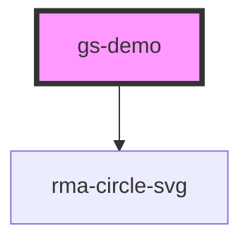

# gs-demo

<!-- Auto Generated Below -->

## Properties

| Property   | Attribute  | Description                                                      | Type           | Default     |
| ---------- | ---------- | ---------------------------------------------------------------- | -------------- | ----------- |
| `disabled` | `disabled` | If true, the button is displayed as disabled                     | `boolean`      | `false`     |
| `label`    | `label`    | This text which is shown as label                                | `string`       | `undefined` |
| `name`     | `name`     | Is needed to reference the form data after the form is submitted | `string`       | `undefined` |
| `options`  | --         | Define the available options in the drop-down list               | `CompOption[]` | `[]`        |

## Dependencies

### Depends on

- [rma-circle-svg](../svg)

### Graph

----------------------------------------------

*Built with [StencilJS](https://stenciljs.com/)*
